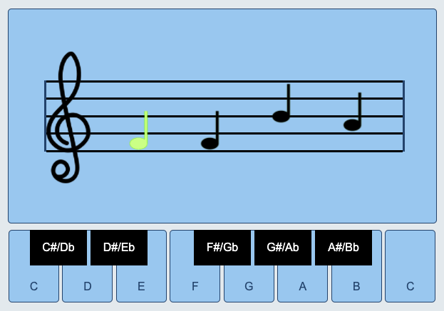

## Christopher Kinsman
## Site Reading Trainer
## Technology: 
- HTML
- Javascript
- CSS

## Description
This is a webpage designed to help users practice their ability to site read musical notation. The webpage was created using HTML, Javascript and CSS. A user opens the page and views a project description with a start button. After clicking start, the viewer sees a strip of sheet music populated by four random notes. After clicking a key a highlighted note progresses through the string of notes. Once all four guesses have been entered, the viewer is presented with their final score.

